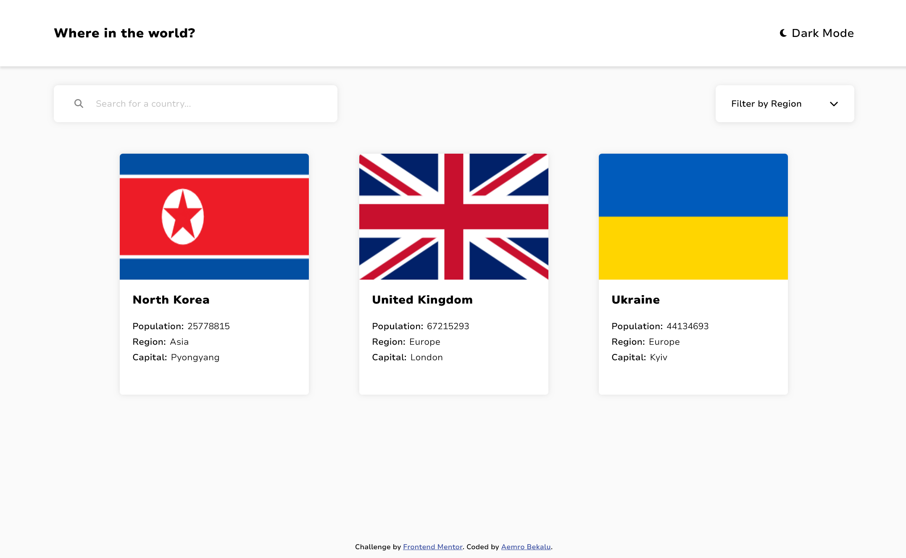
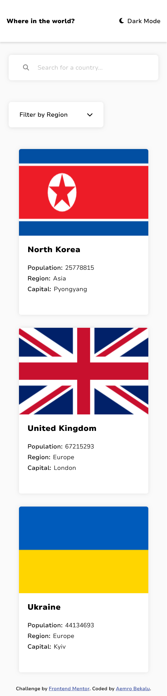

# Frontend Mentor - REST Countries API with color theme switcher solution

This is a solution to the [REST Countries API with color theme switcher challenge on Frontend Mentor](https://www.frontendmentor.io/challenges/rest-countries-api-with-color-theme-switcher-5cacc469fec04111f7b848ca). Frontend Mentor challenges help you improve your coding skills by building realistic projects.

## Table of contents

- [Overview](#overview)
  - [The challenge](#the-challenge)
  - [Screenshot](#screenshot)
  - [Links](#links)
- [My process](#my-process)
  - [Built with](#built-with)
  - [Run The App](#run-the-app)
  - [What I learned](#what-i-learned)
  - [Continued development](#continued-development)
  - [Useful resources](#useful-resources)
- [Author](#author)

## Overview

### The challenge

Users should be able to:

- See all countries from the API on the homepage
- Search for a country using an `input` field
- Filter countries by region
- Click on a country to see more detailed information on a separate page
- Click through to the border countries on the detail page
- Toggle the color scheme between light and dark mode _(optional)_

### Screenshot

### Links

- Solution URL: [solution URL](https://www.frontendmentor.io/solutions/rest-api-challenge-with-color-schemes-react-x6Aqe0DCgE)
- Live Site URL: [live site URL](https://aemrobe.github.io/rest-api-countries-react/)

## My process

### Built with

- Semantic HTML5 markup
- CSS custom properties
- Flexbox
- CSS Grid
- Mobile-first workflow
- [React](https://reactjs.org/) - JS library

### Run The App

Run this command on your terminal: `npm start`
Runs the app in the development mode.\
Open [http://localhost:3000](http://localhost:3000) to view it in your browser.

The page will reload when you make changes.\
You may also see any lint errors in the console.

### What I learned

In this challenge, I have learned how can I work with useEffect and useRef which are the features that are available in react that help us to work with sideeffects(fetching data from api and eventlisteners) and selecting the dom elements in react. I have also implemented a custom hook which is called useFetch which handles all the fetch logic which I have used throughout all the components. this custom hook avoids repeated code which I have used for the fetch api purpose.

### Continued development

For the future, I want to build project by using react and do js challenges.

### Useful resources

- [Font awesome icons](https://www.https://fontawesome.com/) - This helped me to get my icons for the project

- [The Ultimate React Course 2024: React, Next.js, Redux & More](https://www.udemy.com/course/the-ultimate-react-course/?utm_source=adwords&utm_medium=udemyads&utm_campaign=Search_DSA_Alpha_Prof_la.EN_cc.ROW-English&campaigntype=Search&portfolio=ROW-English&language=EN&product=Course&test=&audience=DSA&topic=React_JS&priority=Alpha&utm_content=deal4584&utm_term=_._ag_162511578404_._ad_696197165220_._kw__._de_c_._dm__._pl__._ti_dsa-2090444767094_._li_9075493_._pd__._&matchtype=&gad_source=1&gclid=Cj0KCQiA4fi7BhC5ARIsAEV1YibnzaVcPWf5eefcUIO1JJUfUKGh-F03UaGQjmVzJ64Wp7gtuGgr_94aAkPVEALw_wcB&couponCode=NEWYEARCAREER) - this helped me to learn react from the beginner to intermidiate react and I will continue to use it for the advanced react

## Author

- Frontend Mentor - [@aemrobe](https://www.frontendmentor.io/profile/yourusername)
- Twitter - [@Aemro112](https://www.twitter.com/Aemro112)
